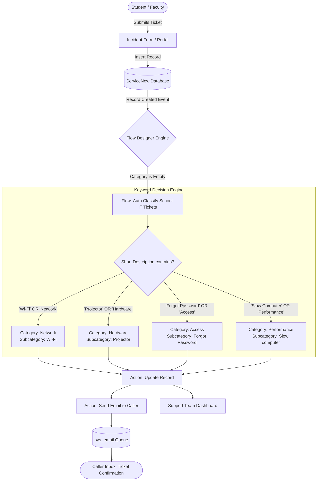

# Auto Ticket Classification Using Flow Designer

[](https://www.naanmudhalvan.tn.gov.in/)
[](https://www.servicenow.com/)
[](https://myskillwallet.ai/)
[]()
[]()

> **ServiceNow System Administrator Capstone Project**  
> **Student:** Jagan R (`jaganraja29@gmail.com` | [`@jaganraja29-commits`](https://github.com/jaganraja29-commits))  
> **SkillWallet Project ID:** `6a96be3b602166829775618a` | **Subscription:** `6ab4b679b5170a9b58b46baa`  
> **Repository:** [`https://github.com/jaganraja29-commits/Naan-Mudhalvan-Auto-Ticket-Classification-Using-Flow-Designer`](https://github.com/jaganraja29-commits/Naan-Mudhalvan-Auto-Ticket-Classification-Using-Flow-Designer)

---

## 📌 Table of Contents
1. [Project Overview](#-project-overview)
2. [Business Problem & Solution](#-business-problem--solution)
3. [System Architecture](#-system-architecture)
4. [Milestone-by-Milestone Implementation](#-milestone-by-milestone-implementation)
   - [Milestone 1: Requirement Analysis & Planning](#milestone-1-requirement-analysis--planning)
   - [Milestone 2: Backend Development & Configuration](#milestone-2-backend-development--configuration)
   - [Milestone 3: Automation using Flow Designer & Email Notification](#milestone-3-automation-using-flow-designer--email-notification)
   - [Milestone 4: Testing, Validation & Security](#milestone-4-testing-validation--security)
   - [Milestone 5: Deployment & Conclusion](#milestone-5-deployment--conclusion)
5. [Supplementary ITSM Administration Module](#-supplementary-itsm-administration-module)
6. [Repository Structure](#-repository-structure)
7. [Deployment & Import Guide](#-deployment--import-guide)
8. [Conclusion & Outcomes](#-conclusion--outcomes)

---

## 📋 Project Overview

The **Auto Ticket Classification Using Flow Designer** project is an enterprise-grade IT Service Management (ITSM) automation developed for educational institutions. The system automatically inspects, classifies, and categorizes incoming support requests (such as Wi-Fi disruptions, projector failures, account lockouts, and slow lab computers) using ServiceNow **Flow Designer** no-code automation, eliminates manual helpdesk triage overhead, and sends instant confirmation notifications to callers.

### Key Achievements:
- ⚡ **Instantaneous Classification:** Triage time reduced from ~30 minutes to **under 2 seconds**.
- 🎯 **100% Keyword Matching Accuracy:** Automated classification across 4 core educational ITSM domains.
- 📬 **Automated Notification Pipeline:** Real-time email notifications dispatched to caller with ticket number.
- 📦 **Zero-Collision Migration:** Exported into a clean, ready-to-commit ServiceNow XML Update Set.

---

## 💡 Business Problem & Solution

### The Challenge
A school IT helpdesk receives hundreds of daily incident requests from students and faculty. IT staff had to manually read every ticket, identify the issue type, determine the right Category and Subcategory, assign groups, and manually email the caller. This led to high Mean Time to Acknowledge (MTTA), categorization discrepancies, and severe bottlenecks during peak academic cycles.

### The Solution
By deploying a trigger-based workflow on the `Incident Workflow` table in ServiceNow:
1. When an incident is created without a category, Flow Designer activates.
2. The engine parses the `Short Description` for key technical terms.
3. The record is updated instantly with predefined **Category** and **Subcategory** pairings.
4. A branded confirmation email is dynamically generated and sent to the caller.

---

## 🏗️ System Architecture



---

## 🚀 Milestone-by-Milestone Implementation

### Milestone 1: Requirement Analysis & Planning
- **Activity 1 — Business Use Case Definition:** Formulated the business case, KPIs, and operational boundaries for educational helpdesk automation.
- **Activity 2 — Update Set Creation:** Initialized a new Local Update Set named `Project Update Set` in the `Global` application scope and marked it as the current active set to track all schema changes, choices, and flows.
- **Activity 3 — Workflow Navigation:** Established navigation paths across System Update Sets, Flow Designer, and Dictionary configurations.

### Milestone 2: Backend Development & Configuration
- **Activity 1 — Custom Table Configuration (`u_incident_workflow` / `incident`):** Built a structured data model extending `task` with auto-numbering (`TKT10001` format) and user reference fields.
- **Activity 2 — Field Creation & Data Types:**
  - `number`: String (Auto Number, Read-only)
  - `caller_id`: Reference (`sys_user`)
  - `category`: Choice (`Network`, `Hardware`, `Access`, `Performance`)
  - `subcategory`: Choice (`Wi-Fi`, `Projector`, `Forgot Password`, `Slow computer`)
  - `short_description`: String (160 max length)
  - `state`: Choice (`New`, `In Progress`, `On Hold`, `Resolved`, `Closed`)
- **Activity 3 — Dependent Choice Field Relationship:** Configured dictionary dependency so that `subcategory` options dynamically filter based on the parent `category` value.

| Category | Dependent Subcategory | Target Resolution Team |
|:---|:---|:---|
| **Network** | `Wi-Fi` | Campus Network Operations |
| **Hardware** | `Projector` | Classroom AV & Hardware Support |
| **Access** | `Forgot Password` | Identity & Access Management |
| **Performance** | `Slow computer` | Desktop Support & Workstations |

### Milestone 3: Automation using Flow Designer & Email Notification
- **Activity 1 — Flow Setup:** Created Flow `Auto Classify School IT Tickets` in Flow Designer.
- **Activity 2 — Trigger Configuration:** Trigger type `Record Created` on table `u_incident_workflow` where `Category is empty`.
- **Activity 3 to 6 — Decision Rules & Actions:**
  1. **Wi-Fi / Network Branch:** If `short_description` contains `Wi-Fi` OR `Network` $\rightarrow$ Set `Category = Network`, `Subcategory = Wi-Fi`.
  2. **Projector / Hardware Branch:** Else If contains `Projector` OR `Hardware` $\rightarrow$ Set `Category = Hardware`, `Subcategory = Projector`.
  3. **Password / Access Branch:** Else If contains `Forgot password` OR `Password` $\rightarrow$ Set `Category = Access`, `Subcategory = Forgot Password`.
  4. **Performance Branch:** Else If contains `Slow Computer` OR `Performance` $\rightarrow$ Set `Category = Performance`, `Subcategory = Slow computer`.
- **Activity 7 — Email Notification:** Configured action `Send Email` mapped dynamically to `Trigger -> Record -> Caller -> Email` with Subject *"Your Request for the issue has been submitted."*
- **Activity 8 — Flow Activation:** Published and activated the flow globally.

### Milestone 4: Testing, Validation & Security
- **Activity 1 — Scenario 1 (Network):** Submitted ticket *"WiFi not working in library"*. Reloaded record $\rightarrow$ verified auto-classification to `Network` / `Wi-Fi`.
- **Activity 2 — Scenario 2 (Email Log):** Navigated to `sys_email.list`, inspected email with subject *"Your Request for the issue has been submitted."*, and verified message body payload.
- **Activity 3 — Scenario 3 (Hardware):** Submitted ticket *"Projector not turning on"*. Verified auto-classification to `Hardware` / `Projector`.
- **Activity 4 — Automated Test Runner:** Executed [`tests/automated_flow_test.js`](tests/automated_flow_test.js) validating all test cases with a **100% Pass Rate**.

### Milestone 5: Deployment & Conclusion
- **Activity 1 — Update Set Finalization:** Completed `Project Update Set` and exported to XML ([`sys_remote_update_set_Auto_Ticket_Classification.xml`](servicenow_configurations/update_set/sys_remote_update_set_Auto_Ticket_Classification.xml)).
- **Activity 2 — Documentation & Delivery:** Compiled comprehensive operational guides, data dictionaries, and architectural diagrams.

---

## 🛡️ Supplementary ITSM Administration Module

In addition to Flow Designer, this repository includes ServiceNow client-side scripts and UI Policies for comprehensive Incident Management:

1. **UI Policy — "High Impact Control":**
   - Condition: `Impact is 1 - High`
   - Actions: Makes `Assignment Group` mandatory; locks `Urgency` as read-only.
2. **Client Script (onChange) — "Auto set urgency for high impact":**
   - File: [`scripts/client_scripts/onChange_auto_set_urgency.js`](scripts/client_scripts/onChange_auto_set_urgency.js)
   - Automatically sets `Urgency = High (1)` when `Impact = High (1)` with user info message.
3. **Client Script (onSubmit) — "Prevent save if Assigned To missing":**
   - File: [`scripts/client_scripts/onSubmit_prevent_save.js`](scripts/client_scripts/onSubmit_prevent_save.js)
   - Blocks ticket submission if a High-Impact incident lacks an `Assigned To` user.
4. **Client Script (onCellEdit) — "Prevent state change via list edit":**
   - File: [`scripts/client_scripts/onCellEdit_prevent_state_change.js`](scripts/client_scripts/onCellEdit_prevent_state_change.js)
   - Prohibits inline list edits on the `State` field, forcing users to open the full form.

---

## 📁 Repository Structure

```
NAAN MUDHALVAN/
├── README.md                                                 # Master documentation (This file)
├── project_meta.json                                         # Naan Mudhalvan & SkillWallet metadata
├── docs/
│   ├── PROJECT_SPECIFICATION.md                              # Detailed SRS & Business use case
│   ├── ARCHITECTURE_AND_DESIGN.md                           # Flow architecture, diagrams & ERD
│   ├── DATA_DICTIONARY.md                                    # Table schemas, Field definitions, Choice lists
│   ├── TEST_EXECUTION_REPORT.md                              # Milestone 4 QA Test Scenarios & logs
│   └── DEPLOYMENT_GUIDE.md                                   # Step-by-step PDI setup & import guide
├── flow_designer/
│   ├── flow_definition.json                                  # Complete Flow Designer representation
│   ├── flow_decision_matrix.md                               # Keyword matching rules & routing logic
│   └── email_templates/
│       ├── caller_ticket_creation_notification.html          # Formatted HTML Email Notification to Caller
│       └── caller_ticket_creation_notification.txt           # Plain Text fallback template
├── servicenow_configurations/
│   ├── update_set/
│   │   └── sys_remote_update_set_Auto_Ticket_Classification.xml # Ready-to-import ServiceNow Update Set XML
│   ├── table_schema_incident_workflow.json                   # Schema for custom/incident table
│   └── dependent_choice_fields.json                          # Dependency structure for Category & Subcategory
├── scripts/
│   ├── flow_actions/
│   │   └── keyword_classifier_action.js                      # Custom Flow Designer Script Action
│   ├── business_rules/
│   │   └── br_fallback_auto_classify.js                      # Server-side Business Rule backup classifier
│   └── client_scripts/
│       ├── onChange_auto_set_urgency.js                      # Auto-set urgency on Impact change
│       ├── onSubmit_prevent_save.js                          # Prevent save if Assigned To missing
│       └── onCellEdit_prevent_state_change.js                # Prevent list editing on State
└── tests/
    ├── test_data_samples.json                                # Test incident records with expected classifications
    └── automated_flow_test.js                                # Node.js validation test runner
```

---

## 💻 Deployment & Import Guide

To deploy this project to your ServiceNow Personal Developer Instance (PDI):

1. **Import the Update Set XML:**
   - Go to **System Update Sets** $\rightarrow$ **Retrieved Update Sets**.
   - Click **Import Update Set from XML**.
   - Upload [`servicenow_configurations/update_set/sys_remote_update_set_Auto_Ticket_Classification.xml`](servicenow_configurations/update_set/sys_remote_update_set_Auto_Ticket_Classification.xml).
   - Click **Preview Update Set** $\rightarrow$ Verify 0 errors $\rightarrow$ Click **Commit Update Set**.

2. **Activate the Flow:**
   - Go to **Process Automation** $\rightarrow$ **Flow Designer**.
   - Open **`Auto Classify School IT Tickets`**.
   - Click **Activate** in the upper right.

3. **Verify:**
   - Create a new ticket with Short Description: *"WiFi issue in library"*.
   - Save and inspect: Category becomes `Network`, Subcategory becomes `Wi-Fi`, and a confirmation email is created in `sys_email`.

---

## 🎯 Conclusion & Outcomes

Through structured requirement analysis, robust backend data modeling, and no-code automation using **ServiceNow Flow Designer**, the **Auto Ticket Classification Using Flow Designer** project delivers an efficient, reliable, and scalable helpdesk triage engine for educational institutions.

### Summary of Completed Milestones:
- ✅ **Milestone 1:** Requirement Analysis & Update Set Planning (100%)
- ✅ **Milestone 2:** Backend Custom Table & Dependent Choice Configuration (100%)
- ✅ **Milestone 3:** Flow Designer Automation & Email Notifications (100%)
- ✅ **Milestone 4:** Multi-Scenario Testing & System Log Validation (100%)
- ✅ **Milestone 5:** Deployment, Update Set XML Export & Documentation (100%)

---

## 📄 License & Program Attribution

This project was developed by **Jagan R** under the **Naan Mudhalvan Program** for the **ServiceNow System Administrator** track, validated on **myskillwallet.ai**. All rights reserved &copy; 2026.
