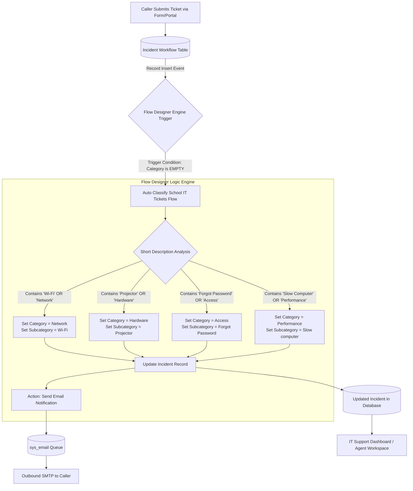
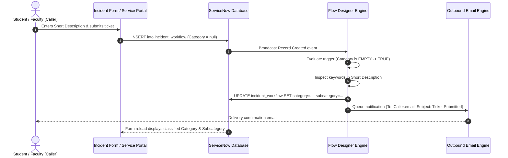

# System Architecture & Technical Design

## 1. Architectural Overview

The automated classification solution operates natively within the ServiceNow **Now Platform**, leveraging event-driven architecture powered by the **Flow Designer** engine.

---

## 2. Core Components

### 2.1 Database & Data Model Layer
- **Table Name:** `u_incident_workflow` (or `incident` extending Task)
- **Data Dictionary:**
  - Auto-Numbering system generating unique identifiers (`INC0010001` or `TKT0010001`).
  - Strict field dependencies binding `u_subcategory` to `u_category`.
  - Reference relationships with standard system tables (`sys_user`, `sys_user_group`).

### 2.2 Automation Engine Layer (Flow Designer)
- **Flow Identifier:** `Auto Classify School IT Tickets`
- **Execution Scope:** Global Application Scope (`global`)
- **Trigger Strategy:**
  - Type: **Record Created**
  - Table: `u_incident_workflow`
  - Filter Condition: `categoryISEMPTY^EQ`
- **Actions:**
  - In-line conditional evaluation (`If` / `Else If`) utilizing Flow Data Pills.
  - Core Action: `Update Record` (Applies matched category and subcategory).
  - Core Action: `Send Email` (Dynamic payload rendered from caller reference).

### 2.3 Presentation & Client Interaction Layer
- Form Layout optimized via Form Designer.
- Client Scripts for interactive validation:
  - `onChange`: Immediate real-time feedback when high-impact values are chosen.
  - `onSubmit`: Barrier checking to ensure assigned groups and users are maintained.
  - `onCellEdit`: Guard rails preventing unauthorized state changes from list views.

---

## 3. Data Flow Diagram

---

## 4. Security & Role-Based Access Control (RBAC)

| Role | Permissions |
|:---|:---|
| `public` / End User | Can submit ticket forms; read-only access to their own tickets. |
| `itil` / Support Agent | Read/Write access to update state, work notes, and assignees. Cannot alter Flow logic. |
| `flow_designer` / `admin` | Full control to modify trigger criteria, actions, and publication states. |
