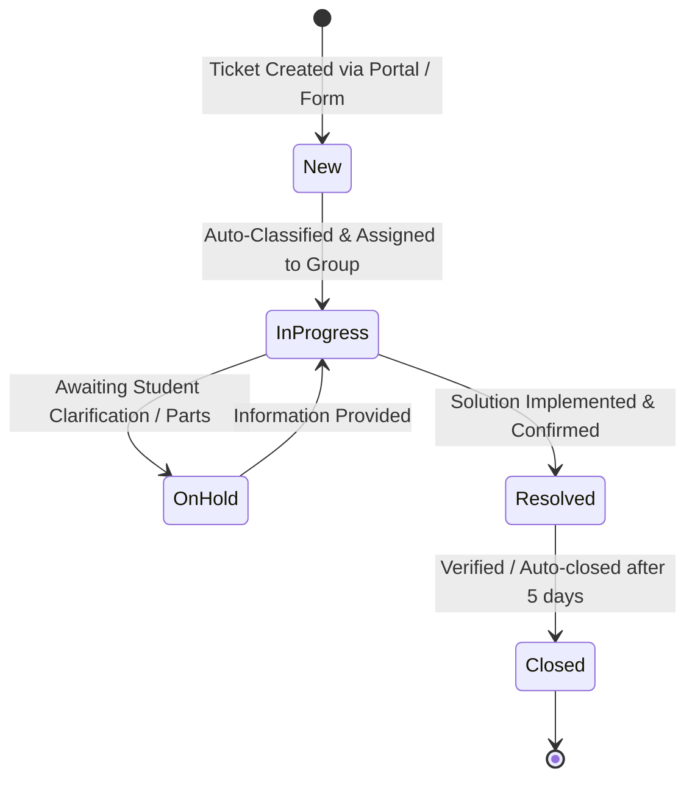

# Data Dictionary & Schema Definitions

## 1. Primary Table: `u_incident_workflow` (or `incident`)

| Column Name | Element Label | Data Type | Max Length | Mandatory | Reference Table / Choices | Description |
|:---|:---|:---:|:---:|:---:|:---|:---|
| `u_number` / `number` | Number | String | 40 | Yes | Auto-numbered prefix `TKT` or `INC` | Unique ticket identifier |
| `caller_id` / `u_caller` | Caller | Reference | 32 | Yes | `sys_user` | The student or faculty reporting the incident |
| `category` / `u_category` | Category | Choice | 40 | No (Auto-set) | `[Network, Hardware, Access, Performance]` | High-level classification |
| `subcategory` / `u_subcategory` | Subcategory | Choice | 40 | No (Auto-set) | `[Wi-Fi, Projector, Forgot Password, Slow computer]` | Detailed classification (Dependent on Category) |
| `short_description` | Short Description | String | 160 | Yes | — | Brief summary parsed by Flow Designer |
| `description` | Description | String | 4000 | No | — | Extended details and context |
| `state` | State | Choice | 40 | Yes | `[1: New, 2: In Progress, 3: On Hold, 6: Resolved, 7: Closed]` | Lifecycle progression |
| `assignment_group` | Assignment Group | Reference | 32 | No | `sys_user_group` | Technical team assigned |
| `assigned_to` | Assigned To | Reference | 32 | No | `sys_user` | Individual technician assigned |
| `sys_created_on` | Created | Date/Time | — | System | — | Timestamp of ticket insertion |

---

## 2. Choice List & Dependency Matrix

The `Subcategory` dictionary entry is configured with:
- **Use dependent field:** `true`
- **Dependent on field:** `category`

| Category Choice Label | Category Value | Dependent Subcategory Label | Subcategory Value | Target Routing Group |
|:---|:---|:---|:---|:---|
| **Network** | `network` / `Network` | **Wi-Fi** | `wifi` / `Wi-Fi` | Campus Network Operations |
| **Hardware** | `hardware` / `Hardware` | **Projector** | `projector` / `Projector` | Classroom AV & Hardware Support |
| **Access** | `access` / `Access` | **Forgot Password** | `forgot_password` / `Forgot Password` | Identity & Access Management (IAM) |
| **Performance** | `performance` / `Performance` | **Slow computer** | `slow_computer` / `Slow computer` | Desktop Support & Workstations |

---

## 3. State Model Progression

